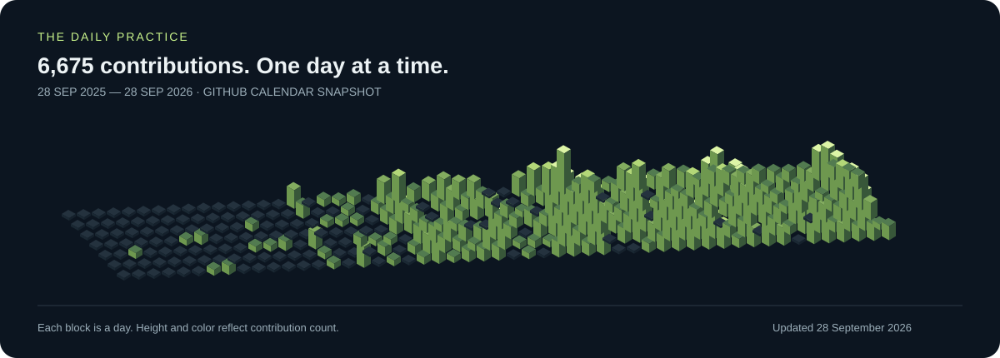

  

  <a href="https://portfolio.ethio-viral.com/"><strong>Explore my portfolio ↗</strong></a>
  &nbsp; · &nbsp;
  <a href="mailto:blackde011@gmail.com">Email</a>
  &nbsp; · &nbsp;
  <a href="https://www.linkedin.com/in/munir-m-3a23353a1/">LinkedIn</a>
  &nbsp; · &nbsp;
  <a href="https://t.me/muay011">Telegram</a>

## A little about me

I'm **Munir Kabir**, a full-stack and AI developer based in **Addis Ababa, Ethiopia**. I build web platforms, mobile apps, chatbots and AI tools, with a focus on software people can use in their everyday work.

My projects connect a few interests: useful automation, thoughtful interfaces and tools for businesses and creators. You'll find work spanning **Ethio Viral**, mobile product development and AI-assisted workflows here.

<table>
<tr>
<td width="33%" valign="top">

### 01 / AI & automation

Chatbots, agents and integrations that connect AI to practical tasks.

**Python · TypeScript · MCP**

</td>
<td width="33%" valign="top">

### 02 / Web & platforms

Full-stack applications, APIs and interfaces for business workflows.

**React · Node.js · TypeScript**

</td>
<td width="33%" valign="top">

### 03 / Mobile experiences

Cross-platform and native apps with clear, focused interfaces.

**Flutter · Dart · Kotlin · Swift**

</td>
</tr>
</table>

## Selected work

A few places to start exploring. Each title opens the source repository.

<table>
<tr>
<td width="50%" valign="top">

### [Ethio Viral MCP ↗](https://github.com/black12-ag/ethio-viral-mcp)

Connects MCP clients to the Ethio Viral partner API for gift cards, subscriptions and social media services.

`TypeScript` &nbsp; `AI integrations`

</td>
<td width="50%" valign="top">

### [Tracker ↗](https://github.com/black12-ag/Tracker)

A lightweight business management app for small-scale liquid soap producers, built with Flutter and Supabase.

`Flutter` &nbsp; `Business tools`

</td>
</tr>
<tr>
<td valign="top">

### [Sartn ↗](https://github.com/black12-ag/sartn)

AI-powered Telegram business automation for Ethiopian entrepreneurs.

`TypeScript` &nbsp; `Telegram`

</td>
<td valign="top">

### [Movie Director ↗](https://github.com/black12-ag/movie-director)

An AI film director skill for Claude, with workflows for Google Flow, character consistency and credit planning.

`AI workflows` &nbsp; `Creator tools`

</td>
</tr>
<tr>
<td valign="top">

### [Nami ↗](https://github.com/black12-ag/nami-quiet-living)

A serene, minimalist lifestyle application for quiet living.

`TypeScript` &nbsp; `Product design`

</td>
<td valign="top">

### [3D Portfolio ↗](https://github.com/black12-ag/3d-portfolio)

A Three.js portfolio with a rigged character, cursor tracking and a full-stack showcase.

`Three.js` &nbsp; `Interactive web`

</td>
</tr>
</table>

[Explore all repositories →](https://github.com/black12-ag?tab=repositories)

## The toolkit

| Where I work | Tools I use |
| :--- | :--- |
| Languages | TypeScript · Python · Swift · Kotlin · Dart |
| Web | React · Node.js |
| Mobile | Flutter · Native Android · Native iOS |
| Workflow | Git · GitHub · APIs · AI agents |

## A year of building

  

A dated snapshot of my GitHub contribution calendar. [View current activity →](https://github.com/black12-ag?tab=overview)

## Let's build something useful

Have a project, an integration or an idea you'd like to talk through?

**[Send me an email →](mailto:blackde011@gmail.com)** &nbsp; [Telegram](https://t.me/muay011) · [LinkedIn](https://www.linkedin.com/in/munir-m-3a23353a1/) · [WhatsApp](https://wa.me/message/XAPGDNH6M4HGB1)

---

Munir Kabir · Addis Ababa, Ethiopia · <a href="https://portfolio.ethio-viral.com/">portfolio.ethio-viral.com</a>

